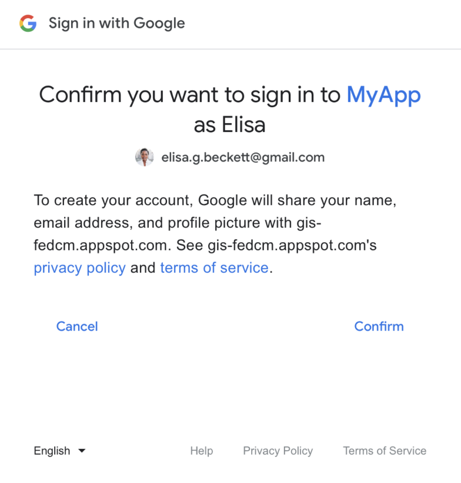

# Google Login API
使用 Google Identity Services(GIS) API

## 實作標準
GIS 中實作了 OAuth2.0 以及 OpenID Connect：
1. OAuth 2.0 是一個授權的協議，授權第三方可以使用使用者的一些資源。藉此，我們便可以使用使用者在 Google 上的一些資源，使用者不需要給予他的密碼。
2. OpenID Connect 讓第三方可以直接獲取 Google 的身份驗證，Google 會基於 OAuth，進一步地發給第三方某個用戶的身份資料。
（Authorization->Authentication）

## OAuth
#### 首先，會先到 GCP 裡面申請一個 OAuth 2.0 的 Client ID
#### [OAuth Client ID 設置教學](https://support.google.com/cloud/answer/6158849?hl=en#:~:text=To%20create%20an%20OAuth%202.0%20client%20ID%20in,New%20Credentials%2C%20then%20select%20OAuth%20client%20ID%20.)
#### [Google identity 教學](https://developers.google.com/identity/gsi/web/guides/get-google-api-clientid?hl=zh-tw)

## 設置 Google Client ID - 開發細節
我設置授權的 Javascript 來源為：
1. http://localhost
2. http://localhost:3000

```javascript
// 前端在發送 HTTP Request 的時候，標頭必須設定：
{'Referrer-Policy': 'no-referrer-when-downgrade'}
// 意指當從 HTTPS 移轉到 HTTP 的時候，不會發送引用者訊息（例如引用者的網域），因為這個標頭不會被加密，這樣可能造成一些被針對性的攻擊
```

#### Google OAuth 同意介面（登入介面以及同意介面）


```javascript
// 在開設伺服器服務前端的時候，因為需要獲取外界的資源，所以需要做一些必要的設置，以避免 CORS 禁止我們讀取 Google 的資料。（不知道 react-server 會不會搞事）
{
    'connect-src': ['self', 'https://accounts.google.com/gsi/'],
    'freme-src': ['self', 'https://accounts.google.com/gsi/'],
    'script-src': ['self', 'https://accounts.google.com/gsi/client'],
    'style-src': ['self', 'https://accounts.google.com/gsi/style'],
}
// 或是設置以下標頭：
{
    'Content-Security-Policy-Report-Only':
    'script-src https://accounts.google.com/gsi/client; frame-src https://accounts.google.com/gsi/; connect-src https://accounts.google.com/gsi/;'

}
// 同時，還要設置以下標頭，來允許 Google 彈出視窗
{
    'Cross-Origin-Opener-Policy': 'same-origin-allow-popups' // 原本僅是 'same-origin'
}
```

我們可以在 Html 中嵌入以下 pure javascript：
```html
<script src="https://accounts.google.com/gsi/client" async defer></script>
<!-- async 以及 defer 可以加快網頁的讀取速度 -->
```
或是如果使用 node.js (commonjs)
```bash
npm install google-auth-library --save
```
```javascript
const {OAuth2Client} = require('google-auth-library');
const client = new OAuth2Client(CLIENT_ID);
async function verify() {
const ticket = await client.verifyIdToken({
idToken: token, // Json web token (JWT)，這個是使用者按下「使用 Google 登入」後回傳的 ID Key（公鑰）
audience: CLIENT_ID, // Specify the CLIENT_ID of the app that accesses the backend
// Or, if multiple clients access the backend:
//[CLIENT_ID_1, CLIENT_ID_2, CLIENT_ID_3]
});
const payload = ticket.getPayload();
const userid = payload['sub']; // get "id"
// 如果想要拿到 email, 可以使用 payload['email']
// If request specified a G Suite domain:
// const domain = payload['hd'];
}
verify().catch(console.error);
```
[Payload 會回傳的東西總覽](https://developers.google.com/identity/gsi/web/reference/js-reference?hl=zh-tw#credential)
#### 「使用 Google 登入」的按鈕
``` html
<script>
  window.onload = function () {
    google.accounts.id.initialize({
      client_id: 'YOUR_GOOGLE_CLIENT_ID',
      callback: handleCredentialResponse
    });
    const parent = document.getElementById('google_btn');
    google.accounts.id.renderButton(parent, {theme: "filled_blue"});
    google.accounts.id.prompt();
  }
</script>
```
總結我們的 Workaround：
1. 把 client id 填入，再將 html script 植入前端中，讓使用者同意授權我們資訊。
2. jwt 回傳回來，將這個東西叫進 callback，我們便可以將這個 token 傳到後端，並且驗證其是否真實授權我們，如果有，我們便可以看到 Google 回傳回來的 Payload
3. 將 email 及 sub 記起來，登入成功。
