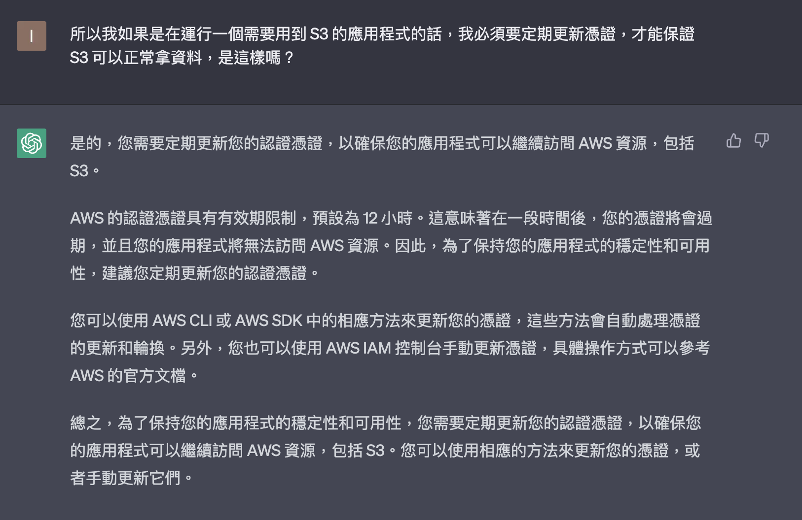
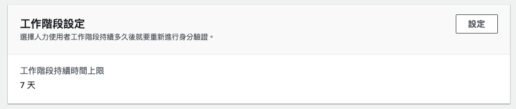
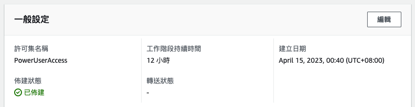

## 處理 Shared Credential File
當創好帳號的時候，就會被授予一組 root credential or an access key。這組密碼包含：Access key ID & 私密的 Access Key。
這組金鑰透過設定後，可以讓我們在 AWS Console 以外的地方去使用 AWS 的資源。
有兩種能夠申請的 Credential：一個是長期的、一個是暫時的。前者 AWS 是不推薦這麼做的。為了申請暫時的憑證，我們可以從 [IAM Identity Center authentication
](https://docs.aws.amazon.com/sdkref/latest/guide/access-sso.html) 中獲得我們需要的資訊。

### IAM Identity Center authentication
AWS IAM Identity Center (successor to AWS Single Sign-On)

Step 1. Enable IAM Identity Center
第一步需要先去 AWS 的管理指令欄然後使用 Root 登入。Root 可以用我們知道的電子郵件和密碼登入，
####
[AWS Management Console](https://ap-northeast-1.console.aws.amazon.com/console/home?region=ap-northeast-1#)
這個畫面看起來會是平常會看到的儀表板主頁。然後已經使用 Root 身份登入了。
####
使用 [IAM Identity Center](https://ap-southeast-2.console.aws.amazon.com/singlesignon/home?region=ap-southeast-2#!/) 並使用內建的，創建一個 Identity Center 目錄。在創建之前，也需要創建 AWS Organization。IAM Identity Center 便是在管理 AWS Organization 裡面所有帳號的 IAM 身份，並控制著 Organization 裡面資源的存取權限。

Step 2. Choose your identity source
####
通常直接使用內建的 Identity Source：Identity Center Directory 就好了，其他的選項還有 Active Directory 或其他的 Identity Provider。例如我們可以透過 SAML 2.0 串接 Google Cloud Identity Platform。只要有 Protocol 的支援，就可以透過快速的方式進行登入。

...

最後可以得到一個 AWS 存取入口網站 URL，可以稱呼為 Portal。[AWS Access Portal URL](https://d-956762ee36.awsapps.com/start)，在這些 Step 裡面我已經設定好了一個擁有 AdministratorAccess 的角色成員 jounglab112a，之後都可以以這個角色進行登入，而不必再使用 Root，除非要調整特別的 IAM 權限等等。
####
我為 jounglab112a 賦予了 AdministratorAccess 以及 PowerUserAccess，在開發上會直接選擇後者進行使用。
####

## 安裝 AWS CLI
[Installing or updating the latest version of the AWS CLI](https://docs.aws.amazon.com/cli/latest/userguide/getting-started-install.html)
####
我們會透過這個 CLI 來進入上面有得到的 AWS Access Portal URL。首先需要先在 CLI 上設定 SSO 的相關細節，讓我們之後不需要再透過瀏覽器 Portal 按下「Command Line or programmatic access」的請求，可以自動發送請求以及更新。
####
[Configure your profile with the aws configure sso wizard](https://docs.aws.amazon.com/cli/latest/userguide/sso-configure-profile-token.html#sso-configure-profile-token-auto-sso)
``` bash
aws configure sso
## 透過 configure 好的 sso Login
aws sso login --sso-session My-sso
## 下面兩個可以 session login 的結果，雖然我下面這兩個都不太成功，但是在 ~/.aws/cli/cache 可以看到我有成功拿到 AWS_ACCESS_KEY_ID, AWS_SECRET_KEY & AWS_SESSION_TOKEN 等等
aws configure list
aws sts get-caller-identity
```

AWS-SDK 不知道有沒有附一些自動更新憑證的功能，畢竟使用 aws sso login 也是一個人工的方法。AWS 上有提到「The maximum session length has been extended to seven days to reduce the need for frequent sign-ins.」這需要列進 TODO。
[Set session duration](https://docs.aws.amazon.com/singlesignon/latest/userguide/howtosessionduration.html)

The permission set credentials are returned from a call to getRoleCredentials of the IAM Identity Center API to the SDK.

[進一步瞭解 SSO 與 SDK & API 的互動機制](https://docs.aws.amazon.com/sdkref/latest/guide/understanding-sso.html)

所以應該是會有兩種類型的 Token：
1. IAM Identity Center Access Portal Session Token：這個包含了一個可以 Refresh 的 Token，AWS Cred 過期而這個若尚未過期，可以自動 Refresh 一個 AWS Cred。
2. AWS (sigv4) Credentials


